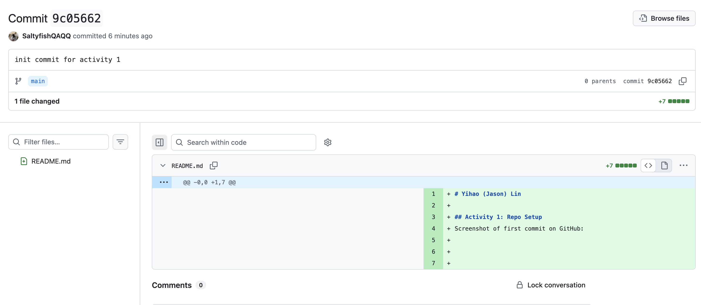
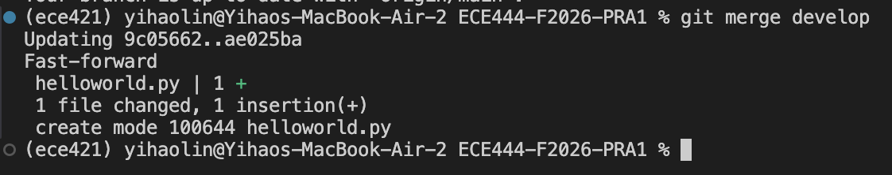
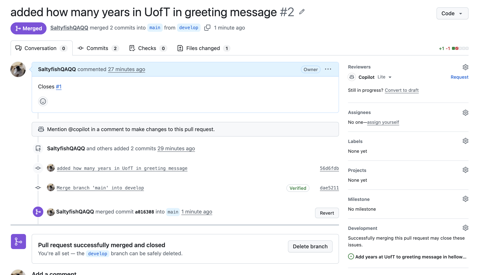
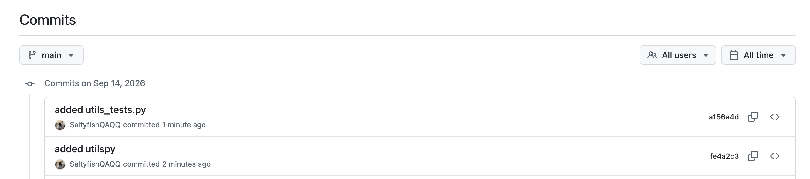

# Yihao (Jason) Lin

## Activity 1
Screenshot of first commit on GitHub:

## Activity 2
Screenshot of the merge command output on the main branch:

## Activity 3: Issues, Pull Requests, and Merge Conflicts
Screenshot of the successful merge after resolving the conflict:

## Activity 4: Unit Tests
Screenshot of the commits for utils.py and utils_tests.py:

<!-- 
## Activity 5: Git Rebase
Screenshots of the rebase commands and their output:

 -->